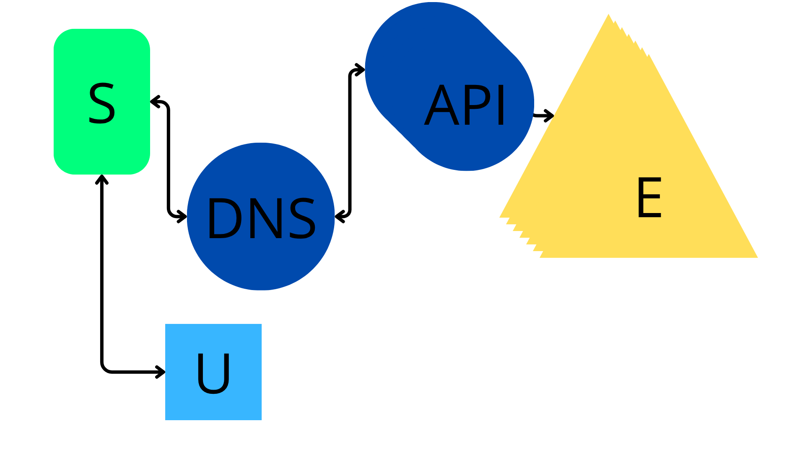

# Round Browser

An open-source browser with simple interface, custom protocol and search engine.

# What is and how does the protocol and search engine work?

`globe://` is a custom protocol which works almost like `https://`, with TCP sockets and SHA-512.
The search engine is **Globe Search**, another open-source project.
Globe Search works by connecting to the central server, searching for the indexed websites, and establishing a connection to the requested website's server. As shown in the
folowing diagram:

- The green "S" is the **server**
- The blue "U" is the **user**
- The overlapping E's are the **External Servers**

# How to publish my website?

Well, to publish your site, you need three things:
1. Your site
2. A server(which can be your computer)
3. GPSA(Globe Protocol Search API; the *API circle* shown on the diagram above)
